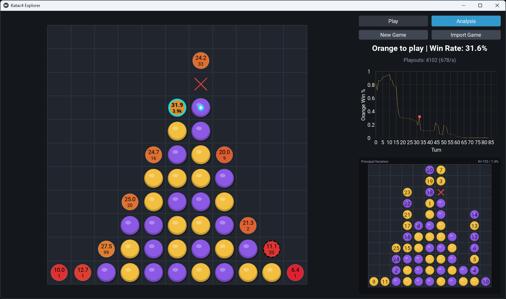

# katac4

An AlphaZero engine for [Saiblo Connect4](https://www.saiblo.net/game/3), featuring a pure Python implementation of key [KataGo](https://github.com/lightvector/KataGo) techniques.



## Project Structure

```
katac4/
├── README.md         # This file
├── LICENSE           # MIT License
│
├── runs/             # TensorBoard logs
├── weights/          # Model checkpoints for each training run
│
├── docs/             # Documentation files
│   └── methods.md     # Overview of improvements over original AlphaZero
│
├── saiblo/           # Saiblo Connect4 submission package
│   ├── main.py        # Entry point
│   ├── game.py        # Standalone game environment (with zobrist hash)
│   └── search.py      # Monte Carlo Graph Search, used during online play
│
├── train.py          # Main training script
├── model.py          # Neural network model definition (b3c128nbt)
├── game.py           # Game environment
├── mcts.py           # Monte Carlo Tree Search, used during training
├── elo_eval.py       # Script for evaluating model ELO ratings
├── elo_plot.py       # Plots ELO rating progression
├── elo.json          # ELO ratings generated by elo_eval.py
├── export_model.py   # Converts model to TorchScript for deployment
├── benchmark.py      # Benchmarks model performance
├── human_play.py     # Play with the model via text
└── explorer_main.py  # Explorer GUI entry point
```

## Quick Start

### Self-Play Training

Before starting self-play training, you may want to adjust a few parameters in `train.py`:

* `epochs`: Total number of training epochs
* `epoch_size`: Number of self-play games per epoch
* `parallel_games`: Number of games run in parallel
* `num_gpus`: Number of GPUs to utilize

> [!IMPORTANT]
>
> To exactly reproduce the most recent training run, **do not change** the default parameter values in the code.

To begin training, run:

```bash
python3 train.py
```

Model checkpoints will be saved to the `weights/` directory. To monitor progress with TensorBoard:

```bash
tensorboard --logdir runs
```

### ELO Evaluation

To evaluate model performance using ELO, edit the `ai_list` and `weight_format` variables in `elo_eval.py` as needed. Then run:

```bash
python3 elo_eval.py
```

Models will compete in randomized pairings, with results saved to `elo.json`. To visualize the rating progression:

```bash
python3 elo_plot.py
```

> [!NOTE]
>
> The ELO evaluation process is computationally intensive. For reference, the most recent evaluation was based on approximately 300,000 games and required 8 days to complete on four RTX 4090 GPUs.

### Submitting to Saiblo

Select your best-performing model checkpoint (typically the final one or the one with highest ELO), and set its path in `export_model.py`. Export it to TorchScript format by running:

```bash
python3 export_model.py
```

This will generate `model.pt` and `z_lookup.npy` (for LCB move selection) in the `saiblo/` directory. To create your submission, zip **only the files** inside the `saiblo/` folder—**do not include the folder itself** in the archive.

## Explorer GUI

The repo includes a visual explorer (`explorer_main.py`) for playing or analyzing games with a specific checkpoint. Useful for:

- Testing model performance against humans
- Analyzing model behavior on custom board setups
- Reviewing AI games from Saiblo

Special thanks to [KaTrain](https://github.com/sanderland/katrain) and [LizzieYzy](https://github.com/yzyray/lizzieyzy) for inspiration on GUI design and features.

> [!WARNING]
>
> Code for the explorer GUI is ~80% AI-generated, designed only for demonstration purposes and may contain bugs or suboptimal implementations. Feel free to report issues or contribute improvements.

### Run

Set the desired model checkpoint path in `Configuration.model_path`, then run:

```bash
python3 explorer_main.py
```

### Features
- **Play mode**: Human vs AI. Analysis saved for review.
- **Analysis mode**: Infinite playouts, PV preview on hover, move navigation via win-rate graph.
- **Custom boards**: Set height/width and forbidden point; randomized helpers.
- **Import games**: Drag-and-drop or “Import Game” button for JSON data from Saiblo.

### Controls
- **Click a column to move.**
- **Space**: Toggle analysis.
- **Left/Right arrows**: Step through game history.
- **Graph click**: Jump to corresponding game state.
- **Hover a legal move**: Show PV stones and stats bubble.
